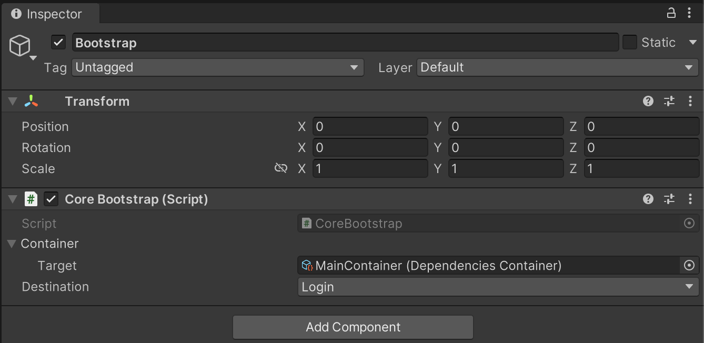
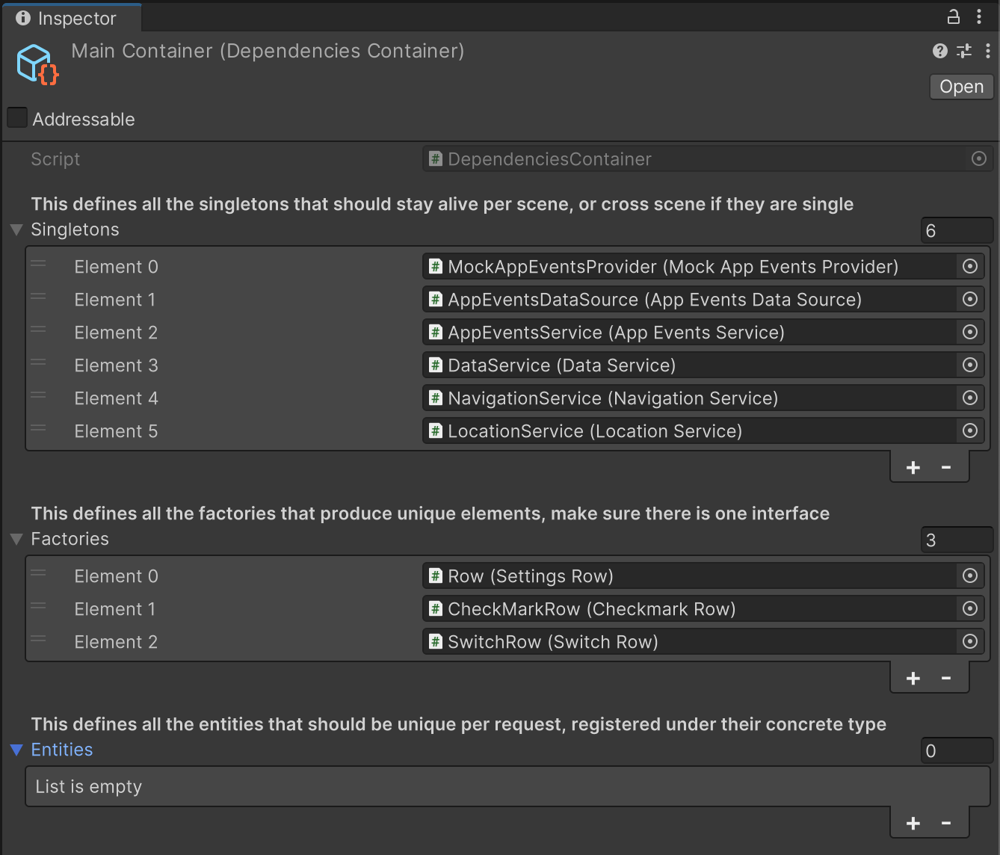

This is a very simple dependency injection tool that allows you to do `MonoBehaviour` Injection and regular constructor injection.
## Setup

Make a script that can hold a reference to our container 

```csharp
public class Core: MonoBehaviour {
    
    [SerializeField] private IRef<IDependenciesContainer> _container;
    
    public static IDependencyProvider provider;
    
    public void Start() {
          
         // Create the container on startup    
         provider = _container.value.Make();
    }
}
```

This following script creates a `IDependencyProvider` on script start, when you attach this script to a `GameObject` we can now give it a container.



This container can be filled with your games dependencies you can find a description below of types that are supported by this DI Framework.



## Supported types

### Singletons

The singletons will be created as a single unique instance and when resolved will always point to the same instance. 
If they get destroyed however they will be re-created by the system automatically.

### Factories

Factories will return a new copy every time you ask for one.

### Entities

Factories that will return a instance based on a concrete type, this is useful if you want to get an instance of a specific type.

### Scriptable Objects

Injects scriptable objects as their interface type

## Creating dependencies

### Via GameObjects
Create an empty `GameObject` and attach your script to it, make sure your script has an interface, and is the first script that is attached to the object


Make a prefab out of the object and assign it into the correct (`Singletons`, `Factories`, `Entities`) slot. The object is now ready to be injected into your project.
### Via constructor
Sometimes we are not dealing with `MonoBehaviours` but with our own custom classes that we also want to be injected. for that we can use the following code to register dependencies. Imagine the following code

```csharp
public interface IDataContainer 
{
   public void Hello();
}

public interface IDataHolder
{
    public string name { get; }
}

public class Data: IDataHolder
{
    public Data(string name)
    {
        _name = name;
    }
    
    private string _name;
    public string name => _name;
}

public class DataContainer: IDataContainer
{
    private IDataHolder _dataHolder;
    
    public DataContainer(IDataHolder holder)
    {
        _dataHolder = holder;
    }

    public void Hello()
    {
        Debug.Log(_dataHolder.name);
    }
}

```

To automatically resolve the above structure the following code can be used to register it as a dependency

```csharp
public class Core: MonoBehaviour {
    
    [SerializeField] private IRef<IDependenciesContainer> _container;
    
    public static IDependencyProvider provider;
    
    public void Start() {
        
        // Register the Data object as a dependency, setting it as a singleton 
        _container.value.Register((provider) => 
        new Data(Guid.NewGuid().ToString()), true);
        
        // Register the DataContainer object as a dependency, setting it as a singleton
        // Using the provider we can grab other dependencies to resolve (make sure they do exist tho)
        _container.value.Register((provider) => 
        new DataContainer(provider.Get<IDataHolder>()), true); 
          
        // Create the container on startup    
        provider = _container.value.Make();
            
        // Resolve a dependency manually
        IDataContainer container = provider.Get<IDataContainer>();
        container.Hello(); // Hello GUID
    }
}
```

## Accessing Dependencies

By accessing the `IDependencyProvider` you can access the `Get<T>()` method to fetch dependencies you want.

```csharp
public class Core: MonoBehaviour {
    
    [SerializeField] private IRef<IDependenciesContainer> _container;
    
    public static IDependencyProvider provider;
    
    public void Start() {
          
         // Create the container on startup    
         provider = _container.value.Make();
         
         // Resolve a dependency manually
         INavigationService navigationService = provider.Get<INavigationService>();
    }
}
```
We can also inject all our dependencies using the below format, this will automatically resolve the dependencies for you,
You can wrap this logic in your own custom `InjectMonoBehaviour` that does this for you on `Awake`.

```csharp
public class GameManager: MonoBehaviour {
    
    [InjectField] private INavigationService _navigationService;
    [InjectField] private IDataContainer _dataContainer;
    
    public void Awake() {
        
        Core.provider.Inject(this);
    }  
  
    public void Start() {
        
        // Will resolve to an instance
        Debug.Log(_navigationService);

        _dataContainer.Hello(); // Hello GUID
    }
}
```
